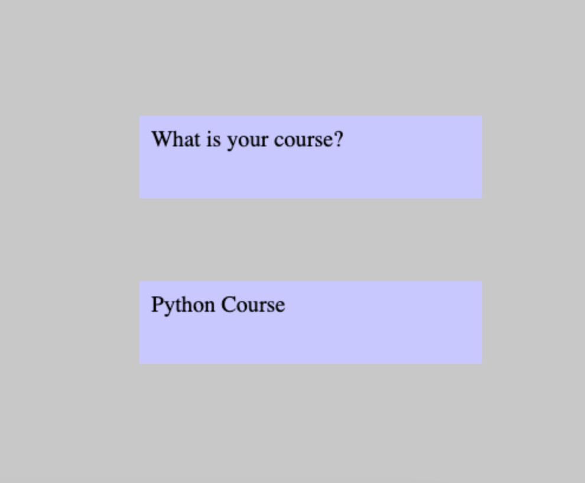

# pygame_Q-and-A
### Task1. Create a game template with a background and game loop.

1. Connect to the Pygame library.

2. Define the game area, 500x500. Make the background any color using the RGB palette (you can make it white).

3. Turn on the text function. Create a font and two captions on the screen: "Question" and "Answer".

4. Start the game. Make sure that the background and the captions on it are displayed.

### Task2. Program the TextArea class for blocks with labels.
1. Program the TextArea class; it's instances are rectangles with labels.

2. Supplement the program code by creating two objects to display questions and answers.

3. Create several question and answer options. Set it to display a random question when you press Q, and an answer when you hit A.